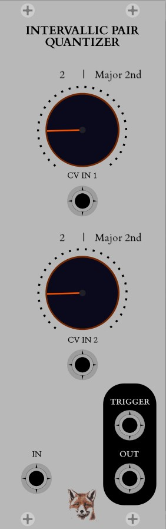

## Intervallic Pair Quantizer

This module quantizes the first voltage it receives like a standard chromatic quantizer, and then quantizes according to Interval 1 -> Interval 2 -> 1 -> 2 -> etc.
Each possible pair of intervals creates a unique sound which is hard to obtain via 'scale based' quantizers.

It quantizes the first voltage it receives like a standard chromatic quantizer, and then quantizes according to Interval 1 -> Interval 2 -> 1 -> 2 -> etc.
So if the current interval is 6 (semitones), it will quantize a new note when the input is 6 semitones or more above/below the last quantized note.

Intervals are counted in the amount of semitones, and are represented by this numerical amount + the interval by its 'western' name (unison, Major 3rd, Minor 7th, etc).

Each interval can be changed via CV IN, 0v-10v, where +/-0v equals a '0' interval (unison), and +/- 10v equals a '11' interval (Major 7th).

TRIGGER sends a trigger on every quantized change of note.
This effectively makes it a rhythmic output, since its rhythm is dictated by the distance from one note to another - smaller intervals=faster note changes, bigger intervals=slower note changes.
For example, you can connect it to the Gate In of an ADSR to sync note changes to individual attacks, or to the Gate/Step of a sequencer to sync note changes to other steps of other sequences.

DEMO:
https://www.youtube.com/watch?v=E_zpPz3iygs

Some of the code is based on modules by VCVRack and CoffeeVCV. Many thanks.
